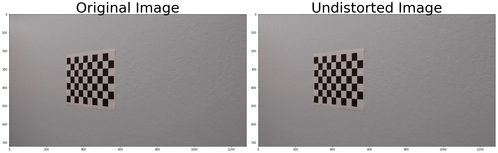
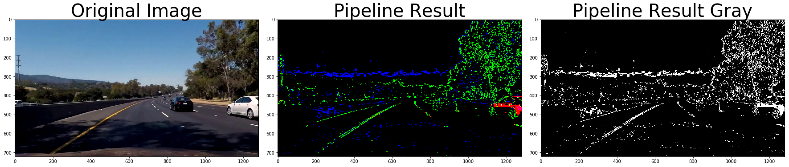
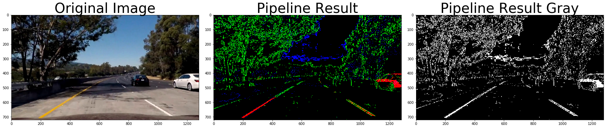
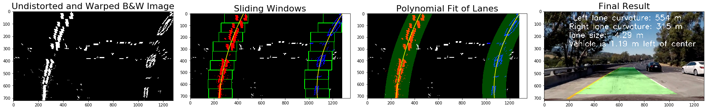

## Advanced Lane Finding Project

The goals / steps of this project are the following:

* Compute the camera calibration matrix and distortion coefficients given a set of chessboard images.
* Apply a distortion correction to raw images.
* Use color transforms, gradients, etc., to create a thresholded binary image.
* Apply a perspective transform to rectify binary image ("birds-eye view").
* Detect lane pixels and fit to find the lane boundary.
* Determine the curvature of the lane and vehicle position with respect to center.
* Warp the detected lane boundaries back onto the original image.
* Output visual display of the lane boundaries and numerical estimation of lane curvature and vehicle position.

---
## First, I'll compute the camera calibration using chessboard images


```python
import numpy as np
import cv2
import glob
import matplotlib.pyplot as plt
%matplotlib qt

# prepare object points, like (0,0,0), (1,0,0), (2,0,0) ....,(6,5,0)
objp = np.zeros((6*9,3), np.float32)
objp[:,:2] = np.mgrid[0:9,0:6].T.reshape(-1,2)

# Arrays to store object points and image points from all the images.
objpoints = [] # 3d points in real world space
imgpoints = [] # 2d points in image plane.

# Make a list of calibration images
images = glob.glob('../camera_cal/calibration*.jpg')

# Step through the list and search for chessboard corners
for fname in images:
    img = cv2.imread(fname)
    gray = cv2.cvtColor(img,cv2.COLOR_BGR2GRAY)

    # Find the chessboard corners
    ret, corners = cv2.findChessboardCorners(gray, (9,6),None)

    # If found, add object points, image points
    if ret == True:
        objpoints.append(objp)
        imgpoints.append(corners)

        # Draw and display the corners
        img = cv2.drawChessboardCorners(img, (9,6), corners, ret)
        cv2.imshow('img',img)
        cv2.waitKey(500)

cv2.destroyAllWindows()
```

In the following section we will apply undistortion function to checkerboard calibration images themselves.


```python
%matplotlib inline

# a function that takes an image, object points, and image points
# performs the camera calibration, image distortion correction and 
# returns the undistorted image
def cal_undistort(img, objpoints, imgpoints):
    # Use cv2.calibrateCamera and cv2.undistort()
    ret, mtx, dist, rvecs, tvecs = cv2.calibrateCamera(objpoints, imgpoints, (img.shape[1], img.shape[0]), None, None)
    undist = cv2.undistort(img, mtx, dist, None, mtx)
    return undist

for fname in images:
    img = cv2.imread(fname)

    undistorted = cal_undistort(img, objpoints, imgpoints)

    f, (ax1, ax2) = plt.subplots(1, 2, figsize=(24, 9))
    f.tight_layout()
    ax1.imshow(img)
    ax1.set_title('Original Image', fontsize=50)
    ax2.imshow(undistorted)
    ax2.set_title('Undistorted Image', fontsize=50)
    plt.subplots_adjust(left=0., right=1, top=0.9, bottom=0.)
```





No we go thru all the test images and undistort them. We store the results in undistorted_images array as well as plot the orinal and undistorted image pairs


```python
test_images = glob.glob('../test_images/*.jpg')

undistorted_images = []

for fname in test_images:
    bgr_img = cv2.imread(fname)
    img = cv2.cvtColor(bgr_img, cv2.COLOR_BGR2RGB)

    undistorted = cal_undistort(img, objpoints, imgpoints)
    undistorted_images.append(undistorted)

    f, (ax1, ax2) = plt.subplots(1, 2, figsize=(24, 9))
    f.tight_layout()
    ax1.imshow(img)
    ax1.set_title('Original Image: ' + fname, fontsize=40)
    ax2.imshow(undistorted)
    ax2.set_title('Undistorted Image', fontsize=40)
    plt.subplots_adjust(left=0., right=1, top=0.9, bottom=0.)
```


The pipeline below combines a thresholded Sobel of size 7 in the X direction of the L channel of the HLS image, thesholded S channel of the HLS image and thresholded channel of the HSV image. The function returns both the color binary used for debugging purposes and the black and white binary for further processing.


```python
# My own pipeline.
def pipeline(img, s_thresh=(90, 95), sx_thresh=(25, 65), sv_thresh=(217, 250)):
    img = np.copy(img)
    # Convert to HLS color space and separate the L and S channels
    hls = cv2.cvtColor(img, cv2.COLOR_RGB2HLS).astype(np.float)
    l_channel = hls[:,:,1]
    s_channel = hls[:,:,2]
    # Convert to HSV color space and separate the V channel
    hsv = cv2.cvtColor(img, cv2.COLOR_RGB2HSV).astype(np.float)
    v_channel = hsv[:,:,2]
    # Sobel x
    sobelx = cv2.Sobel(l_channel, cv2.CV_64F, 1, 0, ksize=7) # Take the derivative in x
    abs_sobelx = np.absolute(sobelx) # Absolute x derivative to accentuate lines away from horizontal
    scaled_sobel = np.uint8(255*abs_sobelx/np.max(abs_sobelx))
    
    # Threshold x gradient
    sxbinary = np.zeros_like(scaled_sobel)
    sxbinary[(scaled_sobel >= sx_thresh[0]) & (scaled_sobel <= sx_thresh[1])] = 1
    
    # Threshold color channel
    s_binary = np.zeros_like(s_channel)
    s_binary[(s_channel >= s_thresh[0]) & (s_channel <= s_thresh[1])] = 1
    
    # Threshold the V channel of the HSV image
    v_binary = np.zeros_like(v_channel)
    v_binary[(v_channel >= sv_thresh[0]) & (v_channel <= sv_thresh[1])] = 1
    
    # Stack each channel
    color_binary = np.dstack(( v_binary, sxbinary, s_binary))
 
    # Combine the three binary thresholds
    combined_binary = np.zeros_like(sxbinary)
    combined_binary[(v_binary == 1) | (sxbinary == 1) | (s_binary == 1)] = 1
    
    return color_binary, combined_binary

# Let's accumulate resulting black and white images as well as plot the original undistorted image, the color image 
# containing the results of all three filter applications of the pipeline and the final black and white result
bw_result_images = []

for image in undistorted_images:
    result, bw_result = pipeline(image)
    bw_result_images.append(bw_result)
    
    # Plot the result
    f, (ax1, ax2, ax3) = plt.subplots(1, 3, figsize=(24, 9))
    f.tight_layout()

    ax1.imshow(image)
    ax1.set_title('Original Image', fontsize=28)

    ax2.imshow(result)
    ax2.set_title('Pipeline Result', fontsize=28)
    
    ax3.imshow(bw_result, cmap='gray')
    ax3.set_title('Pipeline B&W Result', fontsize=28)
    plt.subplots_adjust(left=0., right=1, top=0.9, bottom=0.)
```


The following images were captured in the problematic areas of the first video and were used to properly tune the parameters of the pipeline above. The problematic areas include many shados or transitions from asphalt to cement and back.


```python
foobar_images = glob.glob('../foobar_images/*.jpg')

foobar_undistorted_images = []

for fname in foobar_images:
    bgr_img = cv2.imread(fname)
    image = cv2.cvtColor(bgr_img, cv2.COLOR_BGR2RGB)
    
    result, bw_result = pipeline(image)
    foobar_undistorted_images.append(bw_result)
    
    # Plot the result
    f, (ax1, ax2, ax3) = plt.subplots(1, 3, figsize=(24, 9))
    f.tight_layout()

    ax1.imshow(image)
    ax1.set_title('Original Image', fontsize=40)

    ax2.imshow(result)
    ax2.set_title('Pipeline Result', fontsize=40)
    
    ax3.imshow(bw_result, cmap='gray')
    ax3.set_title('Pipeline Result Gray', fontsize=40)
    plt.subplots_adjust(left=0., right=1, top=0.9, bottom=0.)    
```

    /root/miniconda3/envs/carnd-term1/lib/python3.5/site-packages/matplotlib/pyplot.py:524: RuntimeWarning: More than 20 figures have been opened. Figures created through the pyplot interface (`matplotlib.pyplot.figure`) are retained until explicitly closed and may consume too much memory. (To control this warning, see the rcParam `figure.max_open_warning`).
      max_open_warning, RuntimeWarning)








Here we define a warper function that applies perspective transformation to the trapezoid part of the image. We also go thru undistorted images and draw the trapezoid on them then show transfomed image as well as transformed black and white image.


```python
def warper(img, src, dst):
    # Compute and apply perpective transform
    img_size = (img.shape[1], img.shape[0])
    #print(img_size)
    M = cv2.getPerspectiveTransform(src, dst)
    warped = cv2.warpPerspective(img, M, img_size, flags=cv2.INTER_NEAREST)  # keep same size as input image
    return warped

# b) define 4 source points src = np.float32([[,],[,],[,],[,]])
src = np.float32([[0, 720], [0, 0], [1280, 0], [1280, 720]])    

         #Note: you could pick any four of the detected corners 
         # as long as those four corners define a rectangle
         #One especially smart way to do this would be to use four well-chosen
         # corners that were automatically detected during the undistortion steps
         #We recommend using the automatic detection of corners in your code
# c) define 4 destination points dst = np.float32([[,],[,],[,],[,]])
dst = np.float32([[0, 670],[560, 450],[720, 450],[1280, 670]])

pts = np.array([[0, 670],[560, 450],[720, 450],[1280, 670], [0, 670]], np.int32)
pts = pts.reshape((-1,1,2))
for img in undistorted_images:
    result, bw_result = pipeline(img)
    image = np.copy(img)
    cv2.polylines(image,[pts],True,(255,0,0), 2)                
                
    warped = warper(img, dst, src)
    f, (ax1, ax2, ax3) = plt.subplots(1, 3, figsize=(24, 9))
    f.tight_layout()
    ax1.imshow(image)
    ax1.set_title('Original Image', fontsize=28)
    ax2.imshow(warped)
    ax2.set_title('Undistorted and Warped Image', fontsize=28)
    
    bw_result_warped = warper(bw_result, dst, src)
    ax3.imshow(bw_result_warped, cmap='gray')
    ax3.set_title('Undistorted and Warped B&W Image', fontsize=28)
    
    plt.subplots_adjust(left=0., right=1, top=0.9, bottom=0.)
```


Here we plot the black and white filtered images, the warped images, and the histogram of the bottom half of the warped images. 


```python
for img in undistorted_images:
    result, bw_result = pipeline(img)
    bw_result_warped = warper(bw_result, dst, src)
    #print(bw_result_warped.shape)
    bound = int(bw_result_warped.shape[0]/2)
    #print(bound)
    histogram = np.sum(bw_result_warped[bound:,:], axis=0)
    #plt.plot(histogram)
    
    f, (ax1, ax2, ax3) = plt.subplots(1, 3, figsize=(24, 9))
    f.tight_layout()
    ax1.imshow(bw_result, cmap='gray')
    ax1.set_title('Filtered B&W Image', fontsize=28)

    ax2.imshow(bw_result_warped, cmap='gray')
    ax2.set_title('Warped B&W Image', fontsize=28)
    ax3.plot(histogram)
    ax3.set_title('Histogram of the Bottom Half of Warped Image', fontsize=28)
    
    plt.subplots_adjust(left=0., right=1, top=0.9, bottom=0.)
```


## Appying the whole pipeline, sliding window and polyfit to test images
Here we go thru all the undistorted images, run the pipeline on them, warp the resulting binary, apply histogram to the lower part of the warped image and then run the sliding window algorithm to find the lanes, fit polylines thru the points found and then transform the found lanes and the space between them back to the original undistorted image. We calculate the curvatures of the left and right lanes as well as the distance between the lanes and the distance of the center of the car from the center of the lane and write that info on the undistorted image.


```python
i = 1
for img in undistorted_images:
    result, bw_result = pipeline(img)
    binary_warped = warper(bw_result, dst, src)
    bound = int(binary_warped.shape[0]/2)

    # Assuming you have created a warped binary image called "binary_warped"
    # Take a histogram of the bottom half of the image
    histogram = np.sum(binary_warped[bound:,:], axis=0)
    # Create an output image to draw on and  visualize the result
    out_img = np.dstack((binary_warped, binary_warped, binary_warped))*255
    # Find the peak of the left and right halves of the histogram
    # These will be the starting point for the left and right lines
    midpoint = np.int(histogram.shape[0]/2)
    leftx_base = np.argmax(histogram[:midpoint])
    rightx_base = np.argmax(histogram[midpoint:]) + midpoint

    # Choose the number of sliding windows
    nwindows = 9
    # Set height of windows
    window_height = np.int(binary_warped.shape[0]/nwindows)
    # Identify the x and y positions of all nonzero pixels in the image
    nonzero = binary_warped.nonzero()
    nonzeroy = np.array(nonzero[0])
    nonzerox = np.array(nonzero[1])
    # Current positions to be updated for each window
    leftx_current = leftx_base
    rightx_current = rightx_base
    # Set the width of the windows +/- margin
    margin = 100
    # Set minimum number of pixels found to recenter window
    minpix = 50
    # Create empty lists to receive left and right lane pixel indices
    left_lane_inds = []
    right_lane_inds = []

    # Step through the windows one by one
    for window in range(nwindows):
        # Identify window boundaries in x and y (and right and left)
        win_y_low = binary_warped.shape[0] - (window+1)*window_height
        win_y_high = binary_warped.shape[0] - window*window_height
        win_xleft_low = leftx_current - margin
        win_xleft_high = leftx_current + margin
        win_xright_low = rightx_current - margin
        win_xright_high = rightx_current + margin
        # Draw the windows on the visualization image
        cv2.rectangle(out_img,(win_xleft_low,win_y_low),(win_xleft_high,win_y_high),(0,255,0), 3) 
        cv2.rectangle(out_img,(win_xright_low,win_y_low),(win_xright_high,win_y_high),(0,255,0), 3) 
        # Identify the nonzero pixels in x and y within the window
        good_left_inds = ((nonzeroy >= win_y_low) & (nonzeroy < win_y_high) & (nonzerox >= win_xleft_low) & (nonzerox < win_xleft_high)).nonzero()[0]
        good_right_inds = ((nonzeroy >= win_y_low) & (nonzeroy < win_y_high) & (nonzerox >= win_xright_low) & (nonzerox < win_xright_high)).nonzero()[0]
        # Append these indices to the lists
        left_lane_inds.append(good_left_inds)
        right_lane_inds.append(good_right_inds)
        # If you found > minpix pixels, recenter next window on their mean position
        if len(good_left_inds) > minpix:
            leftx_current = np.int(np.mean(nonzerox[good_left_inds]))
        if len(good_right_inds) > minpix:        
            rightx_current = np.int(np.mean(nonzerox[good_right_inds]))

    # Concatenate the arrays of indices
    left_lane_inds = np.concatenate(left_lane_inds)
    right_lane_inds = np.concatenate(right_lane_inds)

    # Extract left and right line pixel positions
    leftx = nonzerox[left_lane_inds]
    lefty = nonzeroy[left_lane_inds] 
    rightx = nonzerox[right_lane_inds]
    righty = nonzeroy[right_lane_inds] 

    # Fit a second order polynomial to each
    left_fit = np.polyfit(lefty, leftx, 2)
    right_fit = np.polyfit(righty, rightx, 2)
    
    # Generate x and y values for plotting
    ploty = np.linspace(0, binary_warped.shape[0]-1, binary_warped.shape[0] )
    left_fitx = left_fit[0]*ploty**2 + left_fit[1]*ploty + left_fit[2]
    right_fitx = right_fit[0]*ploty**2 + right_fit[1]*ploty + right_fit[2]

    out_img[nonzeroy[left_lane_inds], nonzerox[left_lane_inds]] = [255, 0, 0]
    out_img[nonzeroy[right_lane_inds], nonzerox[right_lane_inds]] = [0, 0, 255]
    
 
    # Create an image to draw on and an image to show the selection window
    out_img2 = np.dstack((binary_warped, binary_warped, binary_warped))*255
    window_img = np.zeros_like(out_img2)
    # Color in left and right line pixels
    out_img2[nonzeroy[left_lane_inds], nonzerox[left_lane_inds]] = [255, 0, 0]
    out_img2[nonzeroy[right_lane_inds], nonzerox[right_lane_inds]] = [0, 0, 255]

    # Generate a polygon to illustrate the search window area
    # And recast the x and y points into usable format for cv2.fillPoly()
    left_line_window1 = np.array([np.transpose(np.vstack([left_fitx-margin, ploty]))])
    left_line_window2 = np.array([np.flipud(np.transpose(np.vstack([left_fitx+margin, ploty])))])
    left_line_pts = np.hstack((left_line_window1, left_line_window2))
    right_line_window1 = np.array([np.transpose(np.vstack([right_fitx-margin, ploty]))])
    right_line_window2 = np.array([np.flipud(np.transpose(np.vstack([right_fitx+margin, ploty])))])
    right_line_pts = np.hstack((right_line_window1, right_line_window2))

    # Draw the lane onto the warped blank image
    cv2.fillPoly(window_img, np.int_([left_line_pts]), (0,255, 0))
    cv2.fillPoly(window_img, np.int_([right_line_pts]), (0,255, 0))
    result = cv2.addWeighted(out_img2, 1, window_img, 0.3, 0) 
    
    f, (ax1, ax2, ax3, ax4) = plt.subplots(1, 4, figsize=(24, 9))
    f.tight_layout()
    ax1.imshow(binary_warped, cmap='gray')
    ax1.set_title('Undistorted and Warped B&W Image', fontsize=22)

    ax2.imshow(out_img)
    ax2.plot(left_fitx, ploty, color='yellow')
    ax2.plot(right_fitx, ploty, color='yellow')
    ax2.set_title('Sliding Windows', fontsize=22)
    
    ax3.imshow(result)
    ax3.plot(left_fitx, ploty, color='yellow')
    ax3.plot(right_fitx, ploty, color='yellow')
    ax3.set_title('Polynomial Fit of Lanes', fontsize=22)
    
    # Define y-value where we want radius of curvature
    # I'll choose the maximum y-value, corresponding to the bottom of the image
    y_eval = np.max(ploty)
    left_curverad = ((1 + (2*left_fit[0]*y_eval + left_fit[1])**2)**1.5) / np.absolute(2*left_fit[0])
    right_curverad = ((1 + (2*right_fit[0]*y_eval + right_fit[1])**2)**1.5) / np.absolute(2*right_fit[0])
    #print(left_curverad, right_curverad)
    # Example values: 1926.74 1908.48

    # Define conversions in x and y from pixels space to meters
    ym_per_pix = 30/720 # meters per pixel in y dimension
    xm_per_pix = 3.7/700 # meters per pixel in x dimension

    # Fit new polynomials to x,y in world space
    left_fit_cr = np.polyfit(lefty*ym_per_pix, leftx*xm_per_pix, 2)
    right_fit_cr = np.polyfit(righty*ym_per_pix, rightx*xm_per_pix, 2)
    # Calculate the new radii of curvature
    left_curverad = ((1 + (2*left_fit_cr[0]*y_eval*ym_per_pix + left_fit_cr[1])**2)**1.5) / np.absolute(2*left_fit_cr[0])
    right_curverad = ((1 + (2*right_fit_cr[0]*y_eval*ym_per_pix + right_fit_cr[1])**2)**1.5) / np.absolute(2*right_fit_cr[0])
    # Now our radius of curvature is in meters
    #print(int(left_curverad), 'm', int(right_curverad), 'm')
    # Example values: 632.1 m    626.2 m
    
    Minv = cv2.getPerspectiveTransform(src, dst)

    # Create an image to draw the lines on
    warp_zero = np.zeros_like(binary_warped).astype(np.uint8)
    color_warp = np.dstack((warp_zero, warp_zero, warp_zero))

    # Recast the x and y points into usable format for cv2.fillPoly()
    pts_left = np.array([np.transpose(np.vstack([left_fitx, ploty]))])
    pts_right = np.array([np.flipud(np.transpose(np.vstack([right_fitx, ploty])))])
    pts = np.hstack((pts_left, pts_right))

    # Draw the lane onto the warped blank image
    cv2.fillPoly(color_warp, np.int_([pts]), (0, 255, 0))

    # Warp the blank back to original image space using inverse perspective matrix (Minv)
    newwarp = cv2.warpPerspective(color_warp, Minv, (img.shape[1], img.shape[0])) 
    # Combine the result with the original image
    final_result = cv2.addWeighted(img, 1, newwarp, 0.3, 0)
    font = cv2.FONT_HERSHEY_SIMPLEX
    cv2.putText(final_result,' Left lane curvature: ' + str(int(left_curverad)) + ' m',(200,70), font, 2,(255,255,255),3)
    cv2.putText(final_result,'Right lane curvature: ' + str(int(right_curverad)) + ' m',(200,70*2), font, 2,(255,255,255),3)
    # size of the lane in meters
    lane_size = np.mean((right_fitx - left_fitx)*xm_per_pix)
    #print('Lane size: %.2f m' % lane_size)
    cv2.putText(final_result,'lane size:  %.2f m' % lane_size,(200,70*3), font, 2,(255,255,255),3)
    
    center_of_lane = (right_fitx[0] + left_fitx[0])/2
    center_of_vehicle = result.shape[1]/2
    #print('center of vehicle in pixels %f' % center_of_vehicle)
    if (center_of_vehicle >= center_of_lane):
        #print('Vehicle is %.2f m right of center' % ((center_of_vehicle - center_of_lane)*xm_per_pix))
        cv2.putText(final_result,'Vehicle is %.2f m right of center' % ((center_of_vehicle - center_of_lane)*xm_per_pix),(200,70*4), font, 2,(255,255,255),3)
    else:
        #print('Vehicle is %.2f m left of center' % ((center_of_lane - center_of_vehicle)*xm_per_pix))
        cv2.putText(final_result,'Vehicle is %.2f m left of center' % ((center_of_lane - center_of_vehicle)*xm_per_pix),(200,70*4), font, 2,(255,255,255),3)
    
    ax4.imshow(final_result)
    ax4.set_title('Final Result', fontsize=22)
    
    plt.subplots_adjust(left=0., right=1, top=0.9, bottom=0.)
    
    final_result = cv2.cvtColor(final_result,cv2.COLOR_RGB2BGR)

    cv2.imwrite("../output_images/test_final_result_" + str(i) + ".jpg", final_result)
    i += 1
```





Here we apply the whole pipeline to the project video.


```python
from moviepy.editor import VideoFileClip

def process_image(image):
    image = cal_undistort(image, objpoints, imgpoints)
    result, bw_result = pipeline(image)
    binary_warped = warper(bw_result, dst, src)
    #print(bw_result_warped.shape)
    bound = int(binary_warped.shape[0]/2)

    # Assuming you have created a warped binary image called "binary_warped"
    # Take a histogram of the bottom half of the image
    histogram = np.sum(binary_warped[bound:,:], axis=0)
    # Create an output image to draw on and  visualize the result
    out_img = np.dstack((binary_warped, binary_warped, binary_warped))*255
    # Find the peak of the left and right halves of the histogram
    # These will be the starting point for the left and right lines
    midpoint = np.int(histogram.shape[0]/2)
    leftx_base = np.argmax(histogram[:midpoint])
    rightx_base = np.argmax(histogram[midpoint:]) + midpoint

    # Choose the number of sliding windows
    nwindows = 9
    # Set height of windows
    window_height = np.int(binary_warped.shape[0]/nwindows)
    # Identify the x and y positions of all nonzero pixels in the image
    nonzero = binary_warped.nonzero()
    nonzeroy = np.array(nonzero[0])
    nonzerox = np.array(nonzero[1])
    # Current positions to be updated for each window
    leftx_current = leftx_base
    rightx_current = rightx_base
    # Set the width of the windows +/- margin
    margin = 100
    # Set minimum number of pixels found to recenter window
    minpix = 50
    # Create empty lists to receive left and right lane pixel indices
    left_lane_inds = []
    right_lane_inds = []

    # Step through the windows one by one
    for window in range(nwindows):
        # Identify window boundaries in x and y (and right and left)
        win_y_low = binary_warped.shape[0] - (window+1)*window_height
        win_y_high = binary_warped.shape[0] - window*window_height
        win_xleft_low = leftx_current - margin
        win_xleft_high = leftx_current + margin
        win_xright_low = rightx_current - margin
        win_xright_high = rightx_current + margin
        # Draw the windows on the visualization image
        cv2.rectangle(out_img,(win_xleft_low,win_y_low),(win_xleft_high,win_y_high),(0,255,0), 3) 
        cv2.rectangle(out_img,(win_xright_low,win_y_low),(win_xright_high,win_y_high),(0,255,0), 3) 
        # Identify the nonzero pixels in x and y within the window
        good_left_inds = ((nonzeroy >= win_y_low) & (nonzeroy < win_y_high) & (nonzerox >= win_xleft_low) & (nonzerox < win_xleft_high)).nonzero()[0]
        good_right_inds = ((nonzeroy >= win_y_low) & (nonzeroy < win_y_high) & (nonzerox >= win_xright_low) & (nonzerox < win_xright_high)).nonzero()[0]
        # Append these indices to the lists
        left_lane_inds.append(good_left_inds)
        right_lane_inds.append(good_right_inds)
        # If you found > minpix pixels, recenter next window on their mean position
        if len(good_left_inds) > minpix:
            leftx_current = np.int(np.mean(nonzerox[good_left_inds]))
        if len(good_right_inds) > minpix:        
            rightx_current = np.int(np.mean(nonzerox[good_right_inds]))

    # Concatenate the arrays of indices
    left_lane_inds = np.concatenate(left_lane_inds)
    right_lane_inds = np.concatenate(right_lane_inds)

    # Extract left and right line pixel positions
    leftx = nonzerox[left_lane_inds]
    lefty = nonzeroy[left_lane_inds] 
    rightx = nonzerox[right_lane_inds]
    righty = nonzeroy[right_lane_inds] 

    # Fit a second order polynomial to each
    left_fit = np.polyfit(lefty, leftx, 2)
    right_fit = np.polyfit(righty, rightx, 2)
    
    # Generate x and y values for plotting
    ploty = np.linspace(0, binary_warped.shape[0]-1, binary_warped.shape[0] )
    left_fitx = left_fit[0]*ploty**2 + left_fit[1]*ploty + left_fit[2]
    right_fitx = right_fit[0]*ploty**2 + right_fit[1]*ploty + right_fit[2]

    out_img[nonzeroy[left_lane_inds], nonzerox[left_lane_inds]] = [255, 0, 0]
    out_img[nonzeroy[right_lane_inds], nonzerox[right_lane_inds]] = [0, 0, 255]
 
    # Create an image to draw on and an image to show the selection window
    out_img2 = np.dstack((binary_warped, binary_warped, binary_warped))*255
    window_img = np.zeros_like(out_img2)
    # Color in left and right line pixels
    out_img2[nonzeroy[left_lane_inds], nonzerox[left_lane_inds]] = [255, 0, 0]
    out_img2[nonzeroy[right_lane_inds], nonzerox[right_lane_inds]] = [0, 0, 255]

    # Generate a polygon to illustrate the search window area
    # And recast the x and y points into usable format for cv2.fillPoly()
    left_line_window1 = np.array([np.transpose(np.vstack([left_fitx-margin, ploty]))])
    left_line_window2 = np.array([np.flipud(np.transpose(np.vstack([left_fitx+margin, ploty])))])
    left_line_pts = np.hstack((left_line_window1, left_line_window2))
    right_line_window1 = np.array([np.transpose(np.vstack([right_fitx-margin, ploty]))])
    right_line_window2 = np.array([np.flipud(np.transpose(np.vstack([right_fitx+margin, ploty])))])
    right_line_pts = np.hstack((right_line_window1, right_line_window2))

    # Draw the lane onto the warped blank image
    cv2.fillPoly(window_img, np.int_([left_line_pts]), (0,255, 0))
    cv2.fillPoly(window_img, np.int_([right_line_pts]), (0,255, 0))
    result = cv2.addWeighted(out_img2, 1, window_img, 0.3, 0) 
    
    # Define y-value where we want radius of curvature
    # I'll choose the maximum y-value, corresponding to the bottom of the image
    y_eval = np.max(ploty)
    left_curverad = ((1 + (2*left_fit[0]*y_eval + left_fit[1])**2)**1.5) / np.absolute(2*left_fit[0])
    right_curverad = ((1 + (2*right_fit[0]*y_eval + right_fit[1])**2)**1.5) / np.absolute(2*right_fit[0])
    # Example values: 1926.74 1908.48

    # Define conversions in x and y from pixels space to meters
    ym_per_pix = 30/720 # meters per pixel in y dimension
    xm_per_pix = 3.7/700 # meters per pixel in x dimension

    # Fit new polynomials to x,y in world space
    left_fit_cr = np.polyfit(lefty*ym_per_pix, leftx*xm_per_pix, 2)
    right_fit_cr = np.polyfit(righty*ym_per_pix, rightx*xm_per_pix, 2)
    # Calculate the new radii of curvature
    left_curverad = ((1 + (2*left_fit_cr[0]*y_eval*ym_per_pix + left_fit_cr[1])**2)**1.5) / np.absolute(2*left_fit_cr[0])
    right_curverad = ((1 + (2*right_fit_cr[0]*y_eval*ym_per_pix + right_fit_cr[1])**2)**1.5) / np.absolute(2*right_fit_cr[0])
    
    Minv = cv2.getPerspectiveTransform(src, dst)

    # Create an image to draw the lines on
    warp_zero = np.zeros_like(binary_warped).astype(np.uint8)
    color_warp = np.dstack((warp_zero, warp_zero, warp_zero))

    # Recast the x and y points into usable format for cv2.fillPoly()
    pts_left = np.array([np.transpose(np.vstack([left_fitx, ploty]))])
    pts_right = np.array([np.flipud(np.transpose(np.vstack([right_fitx, ploty])))])
    pts = np.hstack((pts_left, pts_right))

    # Draw the lane onto the warped blank image
    cv2.fillPoly(color_warp, np.int_([pts]), (0, 255, 0))

    # Warp the blank back to original image space using inverse perspective matrix (Minv)
    newwarp = cv2.warpPerspective(color_warp, Minv, (image.shape[1], image.shape[0])) 
    # Combine the result with the original image
    final_result = cv2.addWeighted(image, 1, newwarp, 0.3, 0)
    
    font = cv2.FONT_HERSHEY_SIMPLEX
    cv2.putText(final_result,' Left lane curvature: ' + str(int(left_curverad)) + ' m',(200,70), font, 2,(255,255,255),3)
    cv2.putText(final_result,'Right lane curvature: ' + str(int(right_curverad)) + ' m',(200,70*2), font, 2,(255,255,255),3)
    # size of the lane in meters
    lane_size = np.mean((right_fitx - left_fitx)*xm_per_pix)
    cv2.putText(final_result,'lane size:  %.2f m' % lane_size,(200,70*3), font, 2,(255,255,255),3)
    
    center_of_lane = (right_fitx[0] + left_fitx[0])/2
    center_of_vehicle = result.shape[1]/2
    if (center_of_vehicle >= center_of_lane):
        cv2.putText(final_result,'Vehicle is %.2f m right of center' % ((center_of_vehicle - center_of_lane)*xm_per_pix),(200,70*4), font, 2,(255,255,255),3)
    else:
        cv2.putText(final_result,'Vehicle is %.2f m left of center' % ((center_of_lane - center_of_vehicle)*xm_per_pix),(200,70*4), font, 2,(255,255,255),3)


    return final_result

white_output = '../project_video_out_final_result.mp4'
clip1 = VideoFileClip("../project_video.mp4")
white_clip = clip1.fl_image(process_image) #NOTE: this function expects color images!!
%time white_clip.write_videofile(white_output, audio=False)
```

    [MoviePy] >>>> Building video ../project_video_out_final_result.mp4
    [MoviePy] Writing video ../project_video_out_final_result.mp4


    100%|█████████▉| 1260/1261 [31:17<00:00,  1.20it/s]   


    [MoviePy] Done.
    [MoviePy] >>>> Video ready: ../project_video_out_final_result.mp4 
    
    CPU times: user 18min 11s, sys: 17.7 s, total: 18min 28s
    Wall time: 31min 18s


## Discussion

The first big issue faced in a project was handling of a difficult area of the video around 40th-41st second of the project video, where the car passes over cement pavement that transitions to a asphalt pavement in the shadow of a tree. To deal with that area, I created an undistorted video first and then output about 30 frames around the area. I then proceeded to tweak parameters of the filters until the left and right lines of the lane were clearly visible: I increased to 7 the size of the Sobel filter, significantly narrowed the size of the threshold for the S-channel and very carefully calibrated the value of the lower bound of the V-channel threshold. Here is the final video https://youtu.be/V0v_Wn3KC00. Unfortunately, my filters fail on the two challenge videos. I also didn't implement any smoothing or caching, which could have improved the performance and accuracy of the lane curvature values.

